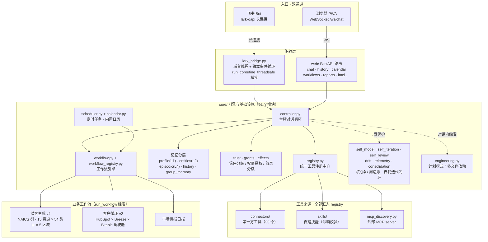

# 贾维斯（Jarvis）

> Ned 的个人 AI 助理 · 本地优先（local-first）· 双通道对话（网页 + 飞书）
> 当前版本 **v3.0.0**

## 这是什么

贾维斯是一个跑在本机的个人 AI 助理，不是一个聊天窗口套壳。它有持久化的分层记忆、
自己的证件/文档保险箱、能在运行时给自己写工具、能按治理规则自己迭代自己的代码，
也承担着真实的业务工作——潜客生成、客户运营、市场情报——不是玩具项目。

后端是 FastAPI + WebSocket，前端是单页 PWA，另外还有一条飞书 Bot 通道，两边共享
同一套记忆/保险箱/工具能力，只是入口不同。主控模型走 OpenRouter
（`deepseek-v4-flash:online`）或 DeepSeek 官方 API，一个配置开关切换供应商，
业务代码不关心到底连的是哪家。

高敏感数据（证件真实号码）严格隔离在本机磁盘密文，绝不进对话历史、绝不上云。

## 核心能力

### 对话与交互
- **双通道入口**：网页 WebSocket 与飞书长连接（`lark_bridge.py`）复用同一个
  `controller.chat()`，同一份记忆/保险箱/工具在两边都可用。
- **正文与工具进度分离**：模型输出的文字和"正在调用哪个工具"是两条独立的事件流，
  不会互相串台、也不会把进度信息混进对话历史。
- **供应商可切换**：`JARVIS_LLM_PROVIDER` 一个开关在 OpenRouter 与 DeepSeek 官方
  API 之间切换，模型名/密钥/base_url 全部联动，不用满仓库改硬编码。

### 分层记忆
- **L1 用户档案**（`core/profile.py`）：少量长期硬事实，每轮钉进 system prompt，
  不随对话滚动淡化。
- **L2 实体记忆**（`core/entities.py`）：客户、料号、供应商这类具体对象的结构化
  事实，精确查（不走向量），模型按需查表。
- **L4 情节记忆**（`core/episodic.py` + `core/embedding.py`）：过往对话摘要与
  经过，本地向量语义召回；长对话被压缩掉的部分自动落盘，不再直接蒸发。
- **持久 transcript**（`core/history.py`）：跨刷新、跨设备续聊。
- **组作用域记忆**（`core/group_memory.py`）：只在用到某个工具组时才有意义的业务
  笔记（比如"跟 HubSpot 打交道时报价规则是……"），不污染全局档案。
- **过程性记忆**（`core/procedures.py`）：不是"是什么"，是"这类问题该怎么解"的
  可复用经验，配合离线的**记忆巩固作业**（`core/consolidation.py`）把近期对话和
  用户的纠正/放弃等监督信号（`core/signals.py`）整理成升级或修正后的长期记忆，而
  不是在对话进行中临场判断"值不值得记"。

### 自建工具 + 自我迭代 + 计划模式
- **运行时自建工具**（`core/tool_builder.py`）：模型给自己写工具——生成代码 →
  AST 沙箱静态校验 → 隔离子进程冒烟测试 → 失败把真实报错喂回自动重生成 → 人工
  审查 → 激活动态加载，全程可在对话（含飞书）内完成，不依赖网页操作。
- **代码边界**（`core/self_model.py`）：全部源码分为 🔒 核心 PROTECTED（框架与
  安全不变量，只能人工改）与 🟢 周边 OPEN（业务能力，可自我迭代），未分类的一律
  按 PROTECTED 处理（fail-safe）。
- **自我迭代闭环**（`self_iteration.py` + `self_review.py`）：反思生成优化提案，
  按区位路由——周边交执行器自动落地（先红后绿验证 + 全量测试 gate，任一步失败
  精确回滚），核心生成审查提案交人工。
- **漂移感知**（`core/drift.py`）：识别 Ned/Claude/编辑器等"外部的手"绕开自己直接
  改了代码，避免自我迭代的快照/回滚假设被打破。
- **计划模式**（`core/engineering.py`）：接住"用户已经在对话里把多文件改动想清楚"
  的场景——`propose`（登记计划）→`execute`（过确认闸，一次确认解锁整个计划）→
  `write`（只能写计划内、判定为 OPEN 的路径）→`run_repo_test`→`finalize`（全量
  测试绿才提交，红则整计划一次性回滚），中途可 `abandon`。

### 安全与信任护栏
- **证件 / 文档保险箱**：Fernet 加密存储，真实值只落本机磁盘密文和用户浏览器，
  模型只接触脱敏预览，绝不经云端 prompt。
- **信任分级与污染闸**（`core/trust.py`）：本轮只要调用过引入不可信外部内容的
  工具（网页/文档/邮件），就标记"污染"，污染状态下禁止再调用对外写入类工具——
  防的是 lethal trifecta 式的提示注入。
- **权限授权闸**（`core/grants.py` + `core/permission_scan.py`）：按【模块】的
  实际代码权限 footprint 审批，而不是按单个工具名，避免同一份代码被反复审好几遍。
- **后台屏蔽**（`BACKGROUND_BLOCKED_TOOLS`）：需要人在场确认的工具（造工具、
  写个人记忆、计划模式六件套等）在后台/定时/子 agent 场景一律屏蔽。

### 定时任务与内置日历
- APScheduler 定时任务 + 预设目录（`core/schedule_presets.py`），前端一键按 cron
  启动。
- **内置日历**（`core/calendar.py`）是系统的时间真源：用户事件真实入表；证件
  到期、文档到期、定时任务下次运行等派生信息由各来源 `register_source` 现算，
  `agenda()` 合并成一条排好序的时间轴。

### 获客与客户运营（业务旗舰工作流）
- **潜客生成 v4**（`intel/workflow_defs.py` + `data/prospect_tree.json`）：
  NAICS 2022 审查驱动的潜客树，15 个赛道 × 54 个产品类目 × 5 个区域（EU/NA/
  SEA/EA/SA）。联网生成候选 → checkpoint 落盘（防止下游失败浪费生成成本）→
  HubSpot 富化匹配 → 出表并推进树；节点可实时查看当前进度、可跳过、可精确
  重跑，全程断点续跑。
- **客户循环 v2**（`prospecting/`）：把 HubSpot 内置 AI「Breeze」当**只读**子
  agent 驱动做 outreach 状态抽取和分层归段，写操作一律走 UI 驱动、不经
  Breeze；飞书多维表格（Bitable）做驾驶舱，贾维斯写状态/分层/轮次等列，
  「list 质量」「处置」两列由 Ned 手写、贾维斯只读不覆盖；「处置」栏的自由文本
  由贾维斯读懂意图（`prospecting/disposition.py`），但只驱动贾维斯侧的安全动作
  （压 FYI / 暂停催 / 出提议），绝不因一句备注去改账户类型或 owner 这类不可逆
  信息；写回加了 cold/dead 护栏，防止被 HubSpot 自身的工作流误挪账户/夺 owner。

### 情报与报告框架
- **注册表家族**：工具、自建技能、定时任务、报告类型、情报台卡片、工作流、
  各层记忆——全部走"注册即可发现"的同构模式，新增一项能力只需注册一条。
- **情报台**（`core/intel_cards.py`）是实时驾驶舱，卡片按 action/monitor/status
  三层，空卡自动隐藏，只在有异常时浮现。
- **市场情报日报**承接"点名公司（金线索）"板块——名单是队列（同一家天天重出是
  缺陷），日报是快照（窗口内重复是正常），两者的打分尺度和资格口径本就不可比，
  刻意分开。

### 能力自知与持续进化
- **模型能力自知**（`core/model_capabilities.py`）+ **子 agent 模型路由**
  （`core/model_routing.py`）+ **能力变化定时检测**（`core/capability_watch.py`）：
  声明式的模型能力表，按任务用途路由到合适的模型，模型获得新能力（比如原生
  视觉）后自动提醒收掉临时补丁，不用人工记得去查。
- **能力索引**（`core/capability.py`）：把工具/工作流/报告/定时任务四处能力清单
  聚合成一份可搜索的总览，造工具前先查重。
- **可观测性**（`core/telemetry.py` + `core/trace.py`）：每次工具调用记一行，
  统一 `trace_id` 贯穿工作流/自我迭代/工具分发，把"这次失败到底是哪一环出的
  问题"从翻时间戳猜测变成可以直接查询。
- **MCP 发现**（`core/mcp_discovery.py`）：零配置接入外部 MCP server 工具。

## 架构图



## 技术栈

| 层 | 选型 |
|----|------|
| Web 框架 | FastAPI + Uvicorn |
| 实时通信 | WebSocket（网页）+ lark-oapi 长连接（飞书） |
| 前端 | 单页 PWA（`frontend/`） |
| 主控模型 | OpenRouter `deepseek-v4-flash:online` 或 DeepSeek 官方 API（`JARVIS_LLM_PROVIDER` 切换） |
| 持久化 | SQLite（`memory.db`，单库多表：history / profile / entities / episodic / vault / calendar） |
| 加密 | `cryptography` Fernet，密钥存系统钥匙串（`keyring`） |
| 本地向量嵌入 | fastembed（`multilingual-e5-small`），未装自动降级为哈希向量 |
| 定时 | APScheduler（`AsyncIOScheduler`） |
| 浏览器自动化 | Playwright（HubSpot / Breeze 驱动） |
| 多维表格 | 飞书 Bitable（客户循环驾驶舱） |
| 文档解析 | pdfplumber / python-docx / openpyxl / python-pptx |
| 本地 OCR | rapidocr-onnxruntime |
| 打包/分发 | setuptools + wheel + Docker |

## 快速开始

```bash
pip install -e .
cp .env.example .env   # 填入模型/飞书/HubSpot 等凭据
python main.py          # 或：jarvis
# 默认 http://127.0.0.1:8000
```

Docker：`docker build -t jarvis .`，容器须显式提供 `MEMORY_ENCRYPTION_KEY` 并挂卷
持久化数据目录。

## 深入阅读

- [`ARCHITECTURE.md`](ARCHITECTURE.md) —— 架构唯一权威文档：分层结构、模块职责、
  关键数据流全细节。
- [`docs/README.md`](docs/README.md) —— 全部文档索引（哪份文档算数、哪份已归档）。
- [`docs/SELF_MODEL.md`](docs/SELF_MODEL.md) —— 核心 🔒 / 周边 🟢 代码边界的人类
  可读镜像（事实源是 `core/self_model.py`）。
